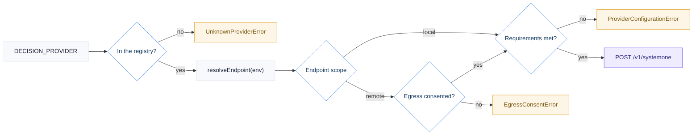

# @sysone/decision-core

**Infra.** The single contract every System One engine implements, the registry of
engines, generic resolution and requirement enforcement, egress consent, the
confidence gate, and one transport.

This package has no database, no filesystem access, and no knowledge of any use
case. It is the package to work in if you are **integrating or tuning an engine**,
and adding one means adding a definition, then opting into it from an executable composition root — generic resolution, transport, persistence, and orchestration remain unchanged,
in no other package.

It is also the package to read if you are **building a use case**: the integration
guide and the wire contracts below are the whole API you need.


```bash
yarn workspace @sysone/decision-core check   # typecheck + unit tests
```

---

## Integrating the System One API

This is what you need if you are building a use case that asks an engine questions.

You never write HTTP. You declare what you want decided, and the shared client handles provider resolution, auth, egress consent, retries, and the confidence gate.

The whole code path is four calls:

```text
createDecisionClient()   →  resolve the provider from the environment
client.systemOne({…})    →  ask bounded questions, one round trip
choiceRoutingValue() + recommendAction()   →  route on the provider's own scale
recordDecision()         →  persist, with the engine and the gating signal recorded
```

### The five steps

<details open>
<summary><b>1 · Depend on infra</b></summary>

```json
{
  "dependencies": {
    "@sysone/decision-core": "workspace:^",
    "@sysone/decision-store": "workspace:^"
  }
}
```

`decision-core` asks questions. `decision-store` persists answers. Never import a concrete engine — the registry is the only path to one.

</details>

<details open>
<summary><b>2 · Create a client</b></summary>

```ts
import { createDecisionClient } from '@sysone/decision-core';

const client = createDecisionClient();          // resolves DECISION_PROVIDER from the environment

client.provider;        // 'laya' | 'kev' | 'jev' | your engine's id
client.providerLabel;   // 'Laya' — for reports and badges
client.config.endpoint; // resolved URL
client.config.endpointScope; // 'local' | 'remote'
```

Resolution order matters: the endpoint is resolved **before** credentials are checked, which is what lets a key be mandatory only when the endpoint is actually off-host. The diagram at the top of this README walks the whole order.

The animated diagram at the top of this README walks that order; the guards are
described under [API contracts](#api-contracts).

Every guard path is reported; none of them discards the evidence you already captured.

</details>

<details open>
<summary><b>3 · Ask bounded questions</b></summary>

One request carries your evidence as `state` and one or more named questions. Ask several at once — it is a single round trip.

```ts
const response = await client.systemOne<'category' | 'is_timeout'>({
  state: {
    test_title: test.title,
    error_message: test.errorMessage,
    stack_trace_excerpt: test.stackTraceExcerpt,
  },
  questions: {
    category: {
      type: 'choice',
      instructions: 'Select the most likely root-cause category from the evidence.',
      criteria: {
        product_bug: 'A genuine defect in the application under test.',
        automation_bug: 'A defect in test code, selectors, assertions, or fixtures.',
        infrastructure_failure: 'CI runner, DNS, network, TLS, container, or platform failed.',
        unknown: 'The evidence is insufficient to assign a category safely.',
      },
    },
    is_timeout: {
      type: 'noul',
      instructions: 'Does the error indicate a wait, assertion, navigation or action timeout?',
    },
  },
});

const answer = response.answers.category; // ChoiceAnswer
```

Keep the option set small and the criteria in your own domain vocabulary. Six flat options spread probability mass; two well-phrased ones concentrate it.

</details>

<details open>
<summary><b>4 · Route the answer through the gate</b></summary>

Never compare a raw confidence to a number of your own choosing. Ask the gate, which reads the resolved provider's own declared scale:

```ts
import { choiceRoutingValue, recommendAction } from '@sysone/decision-core';

const routingValue = choiceRoutingValue(answer, client.config.choiceGate);
const action = recommendAction(routingValue, client.config);
// 'auto_file' | 'flag_for_review' | 'escalate_to_human'
```

This exists because engines do not share a confidence scale. A provider declaring `calibratedChoiceConfidence: false` is gated on the winning option's probability mass instead of its confidence field — applying a confidence threshold to that engine would route every decision to `escalate_to_human`.

</details>

<details open>
<summary><b>5 · Persist through the store</b></summary>

```ts
import { recordDecision } from '@sysone/decision-store';

await recordDecision(transaction, {
  subject: {
    type: 'yourdomain:thing',        // namespaced; opaque to infra
    id: row.id,                      // your table's row id
    label: 'human-readable subject',
    keys: { repo: 'x', item: 'y' },  // the dimensions you aggregate by
  },
  dataOrigin: 'actual_run',
  decisionType: 'failure_triage',    // your vocabulary
  provider: client.provider,
  model: response.model,
  category: answer.choice,
  confidence: answer.confidence,
  recommendedAction: action,
  routingSignal: client.config.choiceGate,
  routingValue,
  result: { ...answer },
  usage: response.usage,
});
```

`recordDecision` accepts a transaction, so your evidence and the decision about it commit atomically. Always persist `routingSignal` and `routingValue`: without them a later cross-engine comparison cannot tell which scale produced an action.

</details>

<details>
<summary><b>Complete worked example</b> — ask, gate, persist, tolerate failure</summary>

```ts
import { createDecisionClient, choiceRoutingValue, recommendAction } from '@sysone/decision-core';
import { createDatabase, recordDecision } from '@sysone/decision-store';

const connection = createDatabase();
const client = createDecisionClient();

try {
  const response = await client.systemOne<'category'>({
    state: { error_message: failure.message, signature: failure.signature },
    questions: {
      category: {
        type: 'choice',
        instructions: 'Select the most likely root cause.',
        criteria: { product_bug: '…', automation_bug: '…', infrastructure_failure: '…' },
      },
    },
  });

  const answer = response.answers.category;
  if (answer.type !== 'choice') throw new Error('expected a Choice answer');

  const routingValue = choiceRoutingValue(answer, client.config.choiceGate);

  await recordDecision(connection.db, {
    subject: { type: 'yourdomain:thing', id: failure.id, label: failure.title },
    dataOrigin: 'actual_run',
    decisionType: 'failure_triage',
    provider: client.provider,
    model: response.model,
    category: answer.choice,
    confidence: answer.confidence,
    recommendedAction: recommendAction(routingValue, client.config),
    routingSignal: client.config.choiceGate,
    routingValue,
    result: { ...answer },
    usage: response.usage,
  });
} catch (error) {
  // An engine that is missing, misconfigured, refused, or down must never cost
  // you the evidence you already have. Report the cause; whether that also fails
  // your command is your use case's policy (the Playwright reference fails the
  // run when triage was enabled, after persisting the evidence).
  console.error(`[yourdomain] triage failed: ${error instanceof Error ? error.message : error}`);
} finally {
  await connection.close();
}
```

</details>

<details>
<summary><b>Switching engines, and comparing them on the same evidence</b></summary>

Selection is configuration, not a second client. The shell wins over `.env`, so it is a per-call choice:

```bash
DECISION_PROVIDER=laya yarn lab experiment:choice   # local, nothing leaves the host
DECISION_PROVIDER=kev  yarn lab experiment:choice   # local, nothing leaves the host
DECISION_PROVIDER=jev  yarn lab experiment:choice   # hosted, requires egress consent
```

Because every row carries its `provider`, one database legitimately holds answers from several engines over the same subjects, and stays comparable afterwards.

```sql
select subject_label, provider, category, confidence, routing_signal, routing_value
from decisions
where decision_type = 'root_cause_choice'
order by subject_label, provider;
```

</details>

---

## API contracts

The wire protocol every engine implements. Declared in `@sysone/decision-core`'s `protocol.ts`, independent of the transport and of provider selection.

<details>
<summary><b><code>POST /v1/systemone</code> — request</b></summary>

```ts
interface SystemOneRequest {
  /** Your evidence. A string, an object, or an array — the engine's input. */
  state: string | Record<string, unknown> | unknown[];
  /** Defaults to the resolved provider's model. */
  model?: string;
  /** Named questions, answered in one round trip. */
  questions: Record<string, Question>;
}
```

Headers set by the client:

```http
POST /v1/systemone HTTP/1.1
Content-Type: application/json
Authorization: Bearer <resolved api key>    # omitted entirely when no key is resolved
```

</details>

<details>
<summary><b>The three question primitives</b></summary>

| Primitive | Asks | `criteria` |
|---|---|---|
| `choice` | Pick one labelled option | `Record<optionId, description>` |
| `score` | Place on an ordered scale | `Array<levelDescription>` |
| `noul` | A probability that something is true | optional `{ true, false }` descriptions |

```ts
interface ChoiceQuestion {
  type: 'choice';
  instructions: string | Record<string, unknown>;
  criteria: Record<string, string | Record<string, unknown> | null>;
}

interface ScoreQuestion {
  type: 'score';
  instructions: string | Record<string, unknown>;
  criteria: Array<string | Record<string, unknown>>;
}

interface NoulQuestion {
  type: 'noul';
  instructions: string | Record<string, unknown>;
  criteria?: { true?: string | Record<string, unknown>; false?: string | Record<string, unknown> };
}
```

</details>

<details>
<summary><b>Response and answer shapes</b></summary>

```ts
interface SystemOneResponse<TQuestionIds extends string = string> {
  model: string;
  answers: Record<TQuestionIds, Answer>;
  usage: { input_tokens: number; output_tokens: number };
  /** Only when the provider declares reportsRouting. Treat as absent otherwise. */
  routing?: { model?: string; repo?: string; reason?: string };
}

interface ChoiceAnswer {
  type: 'choice';
  choice: string;                          // one of your criteria keys
  probabilities: Record<string, number>;   // mass per option
  confidence: number;
}

interface ScoreAnswer {
  type: 'score';
  score: number;
  legend: Record<string, string>;
  probabilities: Record<string, number>;
  confidence: number;
}

interface NoulAnswer {
  type: 'noul';
  noul: number;                            // probability, 0-1
}
```

**A Noul carries no confidence, by design.** Engines that return one only restate `max(p, 1 - p)`, so it is deliberately absent from the type: a Noul must never be gated with a Choice-style confidence threshold.

Always narrow before use — `if (answer.type !== 'choice') throw …` — since `answers` is typed by question id, not by primitive.

</details>

<details>
<summary><b>Errors, retries and rate limits</b></summary>

```ts
class SystemOneError extends Error {
  status: number;    // HTTP status
  body: unknown;     // parsed response body, when there was one
  provider: string;  // which engine failed
}
```

Retries are a policy behind an interface, not a hardcoded rule in the transport:

| Status | Retried | Why |
|---|---|---|
| `429`, `529` | yes | rate limiting |
| `503` | yes | a self-hosted server that is up but still building its checkpoint — normal on a first start |
| anything else | no | surfaced as `SystemOneError` |

Default: 3 retries, exponential backoff from 500 ms (`500`, `1000`, `2000`). Inject `NO_RETRY` or your own `RetryPolicy` to change it; the client also takes `fetchImpl` and `sleep` by injection, which is how the transport is tested without network or real time.

</details>

<details>
<summary><b>Egress consent is derived from the endpoint, never the engine name</b></summary>

An endpoint on loopback, a private range, a `.local`-style suffix, or a single-label hostname (a Compose service name) is **local** and needs no consent. Anything else is **remote** and is refused until consent is explicit:

```text
EgressConsentError: Jev is configured at a remote endpoint
(https://api.typesafe.ai/v1/systemone), so failure evidence would leave this
machine. Set ALLOW_DECISION_DATA_EGRESS=true to consent, or select a
self-hostable provider.
```

Pointing a self-hosted engine at a hosted deployment is therefore refused too. Never weaken this into a per-provider boolean, and never enable egress if your evidence can contain secrets or personal data.

</details>

---

## Provider configuration

Engine-specific configuration lives with the adapter that owns it. This package imports no provider, so it does not document one either.

| Engine | Package | Hosting | Gate reads |
|---|---|---|---|
| Laya | [`@sysone/provider-laya`](../../providers/laya/README.md) | self-hosted, zero egress | `top_probability` |
| Jev | [`@sysone/provider-jev`](../../providers/jev/README.md) | hosted, egress consent required | `confidence` |
| Kev | [`@sysone/provider-kev`](../../providers/kev/README.md) | self-hosted, zero egress | `top_probability` |

What remains generic is below: how declared requirements are enforced without knowing which provider is being enforced, how to tune the gate once you have labels, and what adding an engine involves.

<details>
<summary><b>How requirement levels work, and why they are data</b></summary>

A key is never special-cased in shared code; it carries its own requirement level:

| Requirement | Meaning | Example |
|---|---|---|
| `required` | absent or blank is a configuration error | `JEV_API_KEY` |
| `optional` | absent is normal; the provider supplies a default | `LAYA_MODEL` |
| `required-when-remote` | mandatory only once the resolved endpoint is off-host | `LAYA_API_KEY` |

The generic resolver enforces all of them without knowing which provider it is enforcing, and reports every gap at once:

```text
Provider "jev" is missing required configuration:
  JEV_API_KEY — Bearer token for the hosted API; the service has no anonymous
  access. (required for this provider)
```

</details>

<details>
<summary><b>Tuning the gate against your own labels</b></summary>

No engine's thresholds are tuned against labelled data. Override them once you have ground truth:

```dotenv
DECISION_CHOICE_GATE=confidence     # or top_probability
DECISION_ACT_THRESHOLD=0.60
DECISION_REVIEW_THRESHOLD=0.35
```

Overrides are shared across engines deliberately: once you have labels you tune one active configuration, not a table of vendors.

Do not assume a high number means a correct answer — out of the box (no engine was trained or tuned on this lab's data), on a small private sample of hand-labelled failures, confidence and correctness were anti-correlated for Jev and uninformative for Laya; Kev has not been measured on that sample. Each provider README records what was actually observed for that engine. Measuring it properly is what [`.kiro/specs/decision-eval`](../../../.kiro/specs/decision-eval/requirements.md) is for.

</details>

<details>
<summary><b>Adding a new engine</b> — provider package plus explicit opt-in</summary>

1. Create `packages/providers/<id>` exporting a `DecisionProviderDefinition` and depending on `@sysone/decision-core`.
2. Add independent tests for endpoint scope, auth, requirement enforcement, and gate semantics.
3. Opt an executable use case in from its composition module; that application chooses whether the provider exists and whether it is the default.
4. If locally served, keep its Dockerfile in the provider package and add the concrete service to root `compose.yml`. The generic orchestrator discovers the profile without a code change.
5. Do not change persistence: provider identity is explicit open-text historical provenance.

```ts
// packages/providers/myengine/src/index.ts
import { joinUrl, readEnv, type DecisionProviderDefinition, type ProviderEnv } from '@sysone/decision-core';

const DEFAULT_BASE_URL = 'http://localhost:9000';
const SYSTEM_ONE_PATH = '/v1/systemone';

export const myEngineProvider: DecisionProviderDefinition = {
  id: 'myengine',
  label: 'My Engine',
  summary: '…',
  homepage: '…',
  envKeys: [
    { name: 'MYENGINE_BASE_URL', requirement: 'optional', purpose: '…' },
    { name: 'MYENGINE_API_KEY', requirement: 'required-when-remote', purpose: '…', secret: true },
  ],
  capabilities: {
    selfHostable: true,
    calibratedChoiceConfidence: false,
    reportsRouting: false,
    reportsTokenUsage: true,
  },
  gateDefaults: { choiceGate: 'top_probability', actThreshold: 0.6, reviewThreshold: 0.35 },
  resolveEndpoint: (env: ProviderEnv) =>
    readEnv(env, 'MYENGINE_ENDPOINT') ??
    joinUrl(readEnv(env, 'MYENGINE_BASE_URL') ?? DEFAULT_BASE_URL, SYSTEM_ONE_PATH),
  resolveModel: (env: ProviderEnv) => readEnv(env, 'MYENGINE_MODEL') ?? 'default',
  resolveApiKey: (env: ProviderEnv) => readEnv(env, 'MYENGINE_API_KEY') ?? null,
};
```

**No generic package changes.** Only the new provider package, applications that opt into it, and root Compose when it has a local runtime should change. A core test registers a stub provider and resolves it end to end without changing generic resolution.

</details>

---

## The provider contract

Every engine implements `DecisionProviderDefinition` from `src/contract.ts`. The generic registry starts empty; each executable use case constructs it from the concrete definitions it supports and chooses its own default. Adding an engine changes its definition and applications that intentionally opt into it — never generic resolution, transport, persistence, or orchestration.

A definition declares four things:

```ts
{
  id: 'laya',
  label: 'Laya',

  // 1. Every variable it reads, with its OWN requirement level.
  envKeys: [
    { name: 'LAYA_BASE_URL', requirement: 'optional',            purpose: '…' },
    { name: 'LAYA_API_KEY',  requirement: 'required-when-remote', purpose: '…', secret: true },
  ],

  // 2. Behaviour a consumer might otherwise branch on.
  capabilities: { selfHostable: true, calibratedChoiceConfidence: false, … },

  // 3. Its own starting thresholds.
  gateDefaults: { choiceGate: 'top_probability', actThreshold: 0.6, reviewThreshold: 0.35 },

  // 4. Pure functions of the environment.
  resolveEndpoint(env) { … }, resolveModel(env) { … }, resolveApiKey(env) { … },
}
```

### Mandatory for one engine, optional for another

This is the case the contract is built around. A key is never special-cased in shared code; it carries its own requirement level:

| Requirement | Meaning | Example |
|---|---|---|
| `required` | Absent or blank is a configuration error | `JEV_API_KEY` — the hosted API has no anonymous access |
| `optional` | Absent is normal; the provider supplies a default | `LAYA_MODEL`, `JEV_MODEL` |
| `required-when-remote` | Mandatory only once the resolved endpoint is off-host | `LAYA_API_KEY` — a local server needs none, a hosted one must not be called anonymously |

The generic resolver enforces all of them without knowing which provider it is enforcing, and reports every gap at once:

```text
Provider "jev" is missing required configuration:
  JEV_API_KEY — Bearer token for the hosted API; the service has no anonymous
  access. (required for this provider)
```

### How a provider is resolved

Order matters here. Scope is derived **before** credentials are checked, which is
what lets a key be mandatory only when the resolved endpoint is actually off-host.
The consent step itself is described under
[data egress is decided by endpoint](#data-egress-is-decided-by-endpoint-not-by-engine-name).



None of the three guard paths discards the Playwright run — each one is reported
and the evidence is still persisted.

### Capabilities replace provider checks

Anything a caller would otherwise learn from an `if (provider === …)` is declared instead:

| Capability | Read by | Effect |
|---|---|---|
| `calibratedChoiceConfidence` | the confidence gate | `false` routes on probability mass rather than the engine's confidence field |
| `selfHostable` | egress errors, orchestrator | Suggests a local alternative; a same-named Compose profile is started and health-checked |
| `reportsRouting` | consumers of the optional `routing` block | Treated as absent unless declared |
| `reportsTokenUsage` | usage accounting | Distinguishes real counts from zeros |

### Design principles the code is held to

- **Single responsibility** — `protocol.ts` (wire shapes), `contract.ts` (contract), `registry.ts` (which engines exist), `resolve.ts` (resolution + enforcement), `endpoint-scope.ts`, `egress.ts`, `gate.ts`, `retry-policy.ts`, `system-one-client.ts` (transport only). A use case's own modules are decomposed the same way; see its README.
- **Open/closed** — a test registers a stub engine into an isolated registry and resolves it end to end, proving extension needs no change to shared code.
- **Liskov substitution** — any registered provider is usable wherever another is; differences live in `capabilities` and `gateDefaults`.
- **Interface segregation** — consumers take the narrowest type: `ProviderEnv` rather than `NodeJS.ProcessEnv`, protocol types rather than the client, `RetryPolicy` rather than the transport.
- **Dependency inversion** — nothing outside `providers/` imports a concrete engine; the registry is the only path to one.
- **Explicit composition** — the generic registry has no built-in instance or default. An executable use case constructs a registry from the concrete definitions it supports and chooses its default there. Persistence always receives the resulting provider id explicitly.
