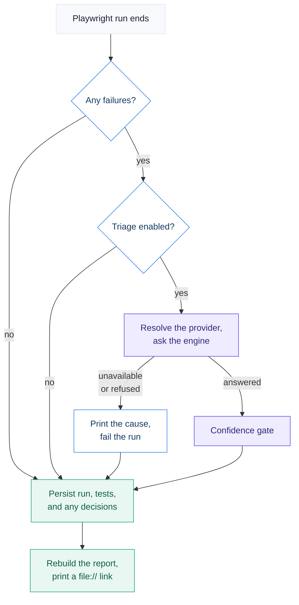

# @sysone/playwright-decisions

**Use case.** System One decisions over live Playwright failures and historical
run history, against a configurable web target (a public demo site by default). It owns its evidence (`test_runs`,
`test_cases`), its questions (the failure taxonomy), its deterministic baseline,
its experiments, and its report.

It depends on `@sysone/decision-core` to ask questions and
`@sysone/decision-store` to persist answers. Nothing in infra depends on it.


```bash
./start                 # infrastructure first
yarn lab seed           # temporary local-validation fixtures
yarn lab e2e            # Playwright suite, persists decisions, refreshes the report
yarn lab report         # rebuild the report on demand
yarn lab experiment:all # historical Noul, Choice and Score experiments
```

The reporter captures final Playwright outcomes, optionally classifies failures,
persists the run, then rebuilds the decision report and prints a clickable link —
even when tests fail:

```text
[decision-lab] Triaging 1 failure(s) via Laya at http://localhost:8000/v1/systemone (local).
[decision-lab] Ingested 1 Playwright run(s), 1 test result(s).
[decision-lab] Report snapshot: 42 run(s), 482 execution(s), 13 logical test(s), 33 decision(s).
[decision-lab] Decision report file:///…/packages/usecases/playwright-decisions/report-output/index.html
```

A render failure is reported but never changes the tests' verdict.

A run has two switches; everything else is fixed (every project, including
`setup`, is persisted, and the report is always rebuilt):

| Flag | Default | Effect |
|---|---|---|
| `DECISION_TRIAGE_ENABLED` | `false` | Ask the engine about every failure. When on, triage is required: an unreachable, misconfigured, or refused engine fails the run. |
| `INGEST_REQUIRED` | `true` | Fail the run when its evidence cannot be persisted. `false` keeps the tests' verdict; the error is still printed and in the manifest. |

<details>
<summary><b>The target under test</b></summary>


The suite ships pointed at [Sauce Demo](https://www.saucedemo.com), a public site
built for automation practice, using the test account it publishes on its own login
page. It is a placeholder: the lab's value comes from real failures, so point it at
your own application.

| File | Owns |
|---|---|
| `.env` → `BASE_URL`, `SITE_USERNAME`, `SITE_PASSWORD` | the target and its test account |
| `tests/support/site.ts` | origin/path split, landing and signed-in paths, auth-state path |
| `tests/pages/*` | locators, via the site's `data-test` hooks (`testIdAttribute` in `playwright.config.ts`) |
| `tests/*.spec.ts` | the checks |

`login-flow.spec.ts` runs anonymously. When credentials are set, `auth.setup.ts`
signs in once and `authenticated-*.spec.ts` reuse that session; with credentials
empty, only the anonymous project runs.

</details>

<details>
<summary><b>How a decision is stored</b></summary>


A decision about a test case is written through `recordDecision` with a subject
built in `src/db/decision-subject.ts`:

```ts
{
  type: 'playwright:test_case',
  id: testCaseId,                       // opaque to infra, joinable here
  label: 'tests/login-flow.spec.ts > login flow',
  keys: { projectId, projectConfiguration, suiteName, testName },
}
```

`keys` carries this lab's logical test identity, the same four dimensions the
flakiness baseline uses, and `src/report/load-report-source.ts` maps them back
into the report model at that single boundary.

</details>

<details>
<summary><b>What each failure asks</b></summary>


One request per failure carries three questions:

- **Choice:** `product_bug`, `automation_bug`, `environment_issue`, `flaky_test`, `infrastructure_failure`, or `unknown`.
- **Noul:** timeout probability.
- **Noul:** network-error probability.

An engine failure never discards the Playwright evidence, but with triage enabled
it does fail the run, with the engine, endpoint, and cause printed.

</details>

<details open>
<summary><b>How a run is routed</b></summary>


Every branch below ends in the same two places: the run is persisted and the
report is rebuilt. An engine that is missing, misconfigured, or refused never
costs you the Playwright evidence. Because triage was asked for, though, it
fails the run: a green exit always means every failure got an answer.



The manifest records which of those paths was taken, as `triageStatus`:

| `triageStatus` | Meaning |
|---|---|
| `not_needed` | The run had no failures, so no engine was called |
| `disabled` | `DECISION_TRIAGE_ENABLED` was false |
| `completed` | Every failure was answered |
| `partial` | Some failures were answered; **the run fails** |
| `failed` | None were: the engine was down, misconfigured, or refused; **the run fails** |

`triageMessage` carries the engine, endpoint, and cause, e.g.
`1 of 1 Laya request(s) to http://localhost:8000/v1/systemone failed: fetch failed (ECONNREFUSED)`.

</details>

<details>
<summary><b>Decision report</b></summary>


The custom report is one portable, dependency-free `index.html`. CSS, JavaScript, SVG icons, and the downloadable JSON snapshot are embedded in the file, so it works fully offline. It renders everything currently in PostgreSQL; there is no dataset selector or hidden filtering.

### Current

The latest persisted pipeline, ordered from decision summary to raw evidence:

- Anchor navigation and an automatically derived one-line insight.
- Severity-coloured pass-rate ring and outcome KPIs with proportional bars.
- Interactive run sequence using uniform status dots; a ring marks retry recovery.
- Needs-attention queue, failure clusters, and a DOM-tallied category chart.
- Searchable test table at the bottom of the information hierarchy.
- Icon-and-label markers on every model-backed classification, named for the engine that produced it.
- Category, confidence, recommended action, model, and probabilities.

### Historical

All persisted evidence and decisions:

- Anchor navigation and a historical evidence summary derived from rendered values.
- Run, execution, logical-test, flaky-test, failure, and decision totals.
- Pass-rate trend and recent-outcome charts built with inline SVG and CSS.
- Root-cause, recommended-action, and primitive distributions.
- Flakiest tests with uniform recent-outcome dots and retry rings.
- Slowest P95 tests using magnitude-encoding bar tracks.
- Searchable historical decision table as the final raw-data layer.
- In-page JSON download generated from the embedded report snapshot.

### Interaction and motion

- Fluid Current/Historical view transitions.
- Shared staggered `rise-in` entrances and `bar-grow` magnitude animation.
- Count-up metrics on first paint and tab switch.
- One shared custom tooltip for titled evidence and decisions.
- Hover/focus feedback and row-location highlighting.
- Light/dark theme persisted as `decision-lab-theme`.
- Keyboard shortcuts: `1`, `2`, `/`, and `Escape`.
- `prefers-reduced-motion` support and print styles.

Product-level naming stays provider-neutral: the heading, CSS classes (`decision-mark`, `decision-metric`, `decision-surface`), theme key, and download filename never name an engine. Engine names appear only on a badge attributing a specific decision.

Every `yarn lab e2e` run rebuilds this file as its last step. Rebuild on demand with:

```bash
yarn lab report
```

### Why there is no Playwright HTML report

This is a decision lab, not a test-automation product, so Playwright's own HTML
report is not generated. It produced a second dashboard competing with this one,
plus roughly fifty bundled files (~2.4 MB) per run. The JSON reporter is omitted
for the same reason: the decision reporter already writes
`test-results/decision-run.json`.

What is still captured is failure **evidence**, not a second UI:

| Artifact | When | How to open |
|---|---|---|
| Trace | on failure | `npx playwright show-trace test-results/run-<runId>/<test>/trace.zip` |
| Screenshot | on failure | any image viewer |
| Run manifest | every run | `test-results/run-<runId>/decision-run.json` (latest also copied to `test-results/decision-run.json`) |
| Triage payload | when triage ran | `triage-output/triage-<runId>.json` |

Every path is keyed by the run id, and so is the `test_runs` row, so an artifact
on disk maps to a database row without guessing.

### Runs are isolated, so they can overlap

Playwright clears its `outputDir` when a run starts. Each run therefore gets its
own `test-results/run-<runId>/`, which means `yarn lab e2e` and `yarn lab e2e:headed` (or
a second terminal, or an open `yarn lab e2e:ui` session) can run at the same time
without waiting on each other.

Sharing one directory was not merely untidy: the second run deleted the first
one's `.playwright-artifacts-*` mid-flight, so tests whose bodies had already
passed failed at `browserContext.close` with a missing `.network` file. This lab
then ingested and triaged those fabricated failures as real evidence. The same
thing happens if `test-results/` is deleted by hand while a run is in flight.

Video is not recorded — it is the heaviest artifact and the least useful for
triage. A unit test asserts the report never links to a Playwright HTML report,
so the competing dashboard cannot creep back in.

</details>

<details>
<summary><b>Temporary local-validation data</b></summary>


Use the single seed only to exercise the entire report and decision flow without repeated live runs or any engine call:

```bash
yarn lab seed
```

It creates 40 temporary runs, 480 executions, and deterministic fixtures for every decision visualization. Fixture decisions use model name `synthetic-local-validator`, so no row claims a real engine answered, and they rotate through every registered provider so each badge path renders without an API call.

After inspection, cleanup is the operator's responsibility:

```bash
yarn clean
./start
```

The report shows whatever is in PostgreSQL and does not distinguish seed fixtures from later test runs.

</details>

<details>
<summary><b>Historical decision experiments</b></summary>


```bash
yarn lab experiment:noul
yarn lab experiment:choice
yarn lab experiment:score
yarn lab experiment:all
```

1. **Noul — is this test flaky?** Compare the model probability with the deterministic baseline.
2. **Choice — what caused the failure?** Apply the lab's failure taxonomy.
3. **Score — how strong is the evidence?** Compare the model score with deterministic evidence ordering.

Each run uses whichever engine `DECISION_PROVIDER` selects, and every answer is persisted
in the `decisions` table with its `provider` column, so the same history can be
evaluated with several engines and compared afterwards.

```bash
DECISION_PROVIDER=jev  yarn lab experiment:all
DECISION_PROVIDER=laya yarn lab experiment:all
```

### Why `src/experiments/` and `src/ground-truth/` are separate

These folders serve different parts of the evaluation contract and are not duplicate runtime implementations:

- `src/experiments/` contains the three executable evaluations behind `yarn lab experiment:*`. They ask the selected engine a Noul, Choice, or Score over persisted run history, store the answer, and print comparison results. The live Playwright reporter remains under `src/reporter/`.
- `src/ground-truth/` contains the deterministic, code-owned flakiness and evidence-strength baseline. The report uses it for historical metrics, and the experiments use it to measure the engine rather than letting the model judge arithmetic or validate itself.

Keeping the baseline independent is intentional: the engine supplies bounded semantic judgment; code supplies counts, formulas, invariants, and the reference result used to evaluate that judgment.

</details>

<details>
<summary><b>Deterministic flakiness baseline</b></summary>


`src/ground-truth/flakiness.ts` is the lab's fixed reference calculation:

```text
flipRate       = flipCount / (non-skipped samples - 1) * 100
retryFlakeRate = retry-recovered passes / non-skipped samples * 100
flakinessScore = max(flipRate, retryFlakeRate)

isFlaky = samples >= 5
       && flakinessScore >= 25
       && (flipCount >= 2 || retryFlakeCount >= 1)
```

Logical identity is:

```text
projectId + suiteName + effectiveProjectConfiguration + testName
```

</details>

<details>
<summary><b>Package map</b></summary>


```text
drizzle/                Generated migrations for this package's evidence tables
playwright.config.ts    Per-run outputDir, projects, and the decision reporter
src/db/                 Evidence schema, ingestion, subject description, migrations
src/reporter/           Capture, triage orchestration, run identity, artifacts, report refresh
src/report/             DB loader, aggregation, charts, and the single-file HTML report
src/triage/             Failure taxonomy and the triage request
src/ground-truth/       Deterministic flakiness and evidence baseline
src/experiments/        Noul, Choice, and Score experiments over persisted history
src/data/               One temporary validation seed
tests/                  Playwright specs and page objects
```

</details>
